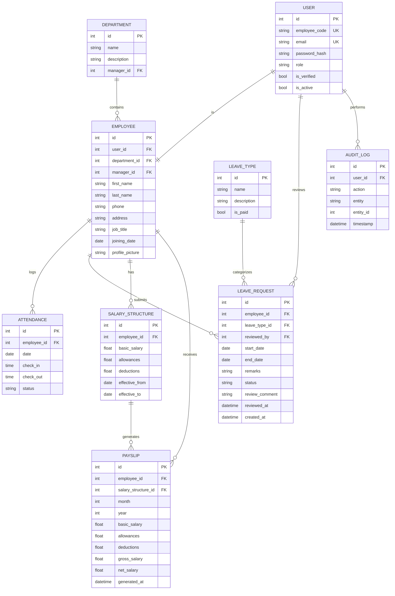

# Dayflow HRMS — Database Design

Backend: PostgreSQL, schema owned entirely by this project via SQLAlchemy
models + Alembic migrations. No framework-provided tables.

## Entity Relationship Diagram

## Table Summary (9 tables)

| Table | Purpose |
|---|---|
| `USER` | Authentication only — login, password, role, email verification |
| `EMPLOYEE` | Core HR record — 1:1 with USER, holds department, job title, manager |
| `DEPARTMENT` | Normalized department list, avoids free-text duplication |
| `ATTENDANCE` | Daily check-in/check-out records per employee |
| `LEAVE_TYPE` | Lookup table: Paid, Sick, Unpaid |
| `LEAVE_REQUEST` | Employee leave applications with admin review trail |
| `SALARY_STRUCTURE` | Time-bound salary components per employee |
| `PAYSLIP` | Immutable monthly snapshot generated from a salary structure |
| `AUDIT_LOG` | Trail of sensitive actions (salary edits, leave decisions) |

## Key design decisions

- **USER vs EMPLOYEE kept separate** — auth concerns stay isolated from
  HR data. Standard practice for any custom-built system, not tied to any
  framework's convention.
- **All operational FKs point to `EMPLOYEE.id`**, not `USER.id` —
  attendance/leave/salary/payslip are facts about an employee, not a
  login session.
- **`role` is a simple string enum** on USER (Employee / Admin-HR) — a
  separate ROLE table is overengineering for two fixed roles.
- **`department_id` is a real FK**, not free text — cheap normalization,
  real payoff (reporting, department head, filtering).
- **`job_title` stays a string** — a DESIGNATION table is unnecessary at
  this scale.
- **Salary kept as flat columns** (basic/allowances/deductions), not a
  fully normalized component table — correct tradeoff for an 8-hour build.
- **PAYSLIP is a frozen snapshot**, decoupled from SALARY_STRUCTURE
  changes — historical pay records must never silently change when salary
  structures are updated later.
- **`EMPLOYEE.manager_id`** — self-referencing FK, nullable, enables a
  lightweight org hierarchy without a separate table.
- **`AUDIT_LOG`** — generic action log, directly supports the security
  evaluation criterion; logged from the service layer on sensitive writes
  (salary changes, leave approve/reject).

## Constraints to enforce

- `UNIQUE(employee_id, date)` on `ATTENDANCE` — one record per employee
  per day.
- `UNIQUE(employee_id, month, year)` on `PAYSLIP` — one payslip per
  employee per pay period.
- `UNIQUE(user_id)` on `EMPLOYEE` — enforces the 1:1 relationship.
- `UNIQUE(email)`, `UNIQUE(employee_code)` on `USER`.
- Only one `SALARY_STRUCTURE` row per employee with `effective_to = null`
  at a time — enforced in service-layer code, not raw SQL: creating a new
  structure auto-closes the previous one.
- Row-level authorization: employees can only query their own
  `ATTENDANCE` / `LEAVE_REQUEST` / `PAYSLIP` rows — enforced in the
  service layer on every request, not just hidden in the UI.

## Business logic notes (not schema, but affects design)

- **Leave approval → attendance sync**: on approval, upsert `ATTENDANCE`
  rows for each date in the leave's range with `status = 'Leave'`, so
  attendance and leave records never drift out of sync.
- **created_at / updated_at**: explicit columns on tables that need them
  (no ORM-provided equivalent here, unlike Odoo) — add `created_at`/
  `updated_at` timestamps directly where the requirement calls for them
  (e.g. `LEAVE_REQUEST.created_at`).
- **Future enhancements** (notifications, analytics/reports) require no
  new tables — buildable as scheduled jobs or aggregation queries over
  the existing schema.
