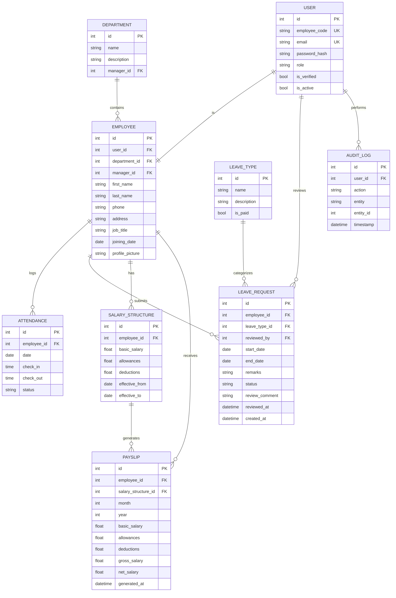

# Dayflow HRMS — Entity Relationship Diagram (ERD)

This document visualizes the complete entity relationship diagram for the **Dayflow HRMS** database.

---

## 📊 Visual ER Diagram

---

## 🗄️ Relational Model Overview

| Entity | Primary Key | Foreign Keys & References | Key Cardinality | Description |
| :--- | :--- | :--- | :--- | :--- |
| **`User`** | `id` (Auto-increment) | None | 1:1 with `Employee` | Authentication identity & role credentials (`employee` vs `admin_hr`). |
| **`Employee`** | `id` (Auto-increment) | `user_id` (Unique FK), `department_id` (FK), `manager_id` (Self-referential FK) | 1:N with `Attendance`, `LeaveRequest`, `SalaryStructure`, `Payslip` | Core employee profile, job details, and organizational reporting hierarchy. |
| **`Department`** | `id` (Auto-increment) | `manager_id` (FK to `Employee.id`) | 1:N with `Employee` | Organizational business units and department manager assignments. |
| **`Attendance`** | `id` (Auto-increment) | `employee_id` (FK to `Employee.id`) | N:1 with `Employee` | Daily work shift tracking, check-in, check-out, and auto-computed status. |
| **`LeaveType`** | `id` (Auto-increment) | None | 1:N with `LeaveRequest` | Policy categories (Paid Time Off, Sick Leave, Unpaid Leave). |
| **`LeaveRequest`**| `id` (Auto-increment) | `employee_id` (FK), `leave_type_id` (FK), `reviewed_by` (FK to `User.id`) | N:1 with `Employee`, `LeaveType`, `User` | Leave applications with review status (`Pending`, `Approved`, `Rejected`) and audit comments. |
| **`SalaryStructure`** | `id` (Auto-increment) | `employee_id` (FK to `Employee.id`) | 1:N with `Payslip` | Active and historical compensation breakdowns with effective date ranges. |
| **`Payslip`** | `id` (Auto-increment) | `employee_id` (FK), `salary_structure_id` (FK) | N:1 with `Employee`, `SalaryStructure` | Immutable point-in-time monthly payroll statement snapshots. |
| **`AuditLog`** | `id` (Auto-increment) | `user_id` (FK to `User.id`) | N:1 with `User` | Immutable system event log capturing administrative writes and approvals. |
