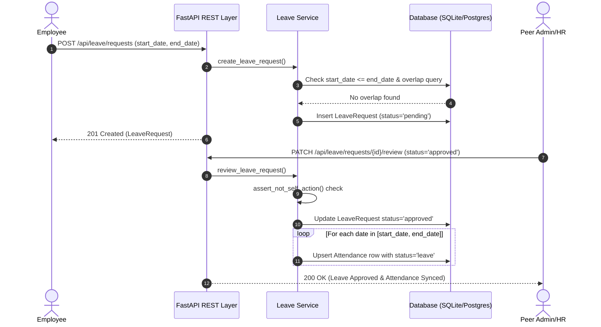
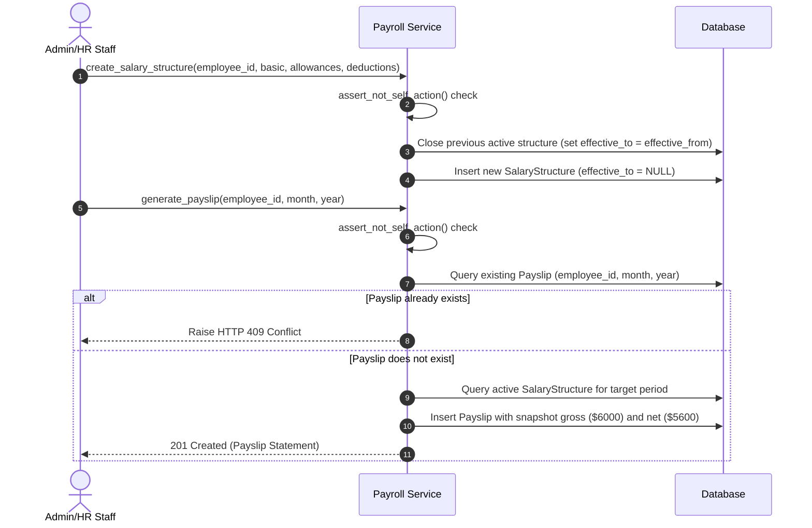

# Dayflow HRMS — Workflows & Business Rules Inventory

This document provides a comprehensive inventory of business rules, system workflows, and rule enforcement locations across **Dayflow HRMS**.

---

## 📋 Rule Inventory Table

### 1. Leave Management Rules (`LEAVE-01` to `LEAVE-09`)

| Rule ID | Business Rule Specification | Enforcing Code Location | Expected API Behavior |
| :--- | :--- | :--- | :--- |
| **LEAVE-01** | `start_date` must not be after `end_date`. Single-day leave (`start_date == end_date`) is permitted. | `app/services/leave_service.py:20` | Returns HTTP 400 Bad Request if `start_date > end_date` |
| **LEAVE-02** | Overlapping leave requests against existing `pending` or `approved` requests are prohibited. | `app/services/leave_service.py:27` | Returns HTTP 400 Bad Request if date ranges intersect |
| **LEAVE-03** | Valid leave applications are created with status `pending`. | `app/services/leave_service.py:46` | Returns HTTP 201 Created with status `pending` |
| **LEAVE-04** | `admin_hr` role can approve pending leave requests. | `app/services/leave_service.py:82` | Updates status to `approved` and records `reviewed_by`/`reviewed_at` |
| **LEAVE-05** | `admin_hr` role can reject leave requests with review comments. | `app/services/leave_service.py:92` | Updates status to `rejected` and stores comment |
| **LEAVE-06** | `employee` role cannot call approval or rejection endpoints. | `app/services/leave_service.py:82` | Returns HTTP 403 Forbidden |
| **LEAVE-07** | Leave approval automatically creates/updates `Attendance` rows with `status='leave'` for each day in range. | `app/services/leave_service.py:100` | Syncs attendance calendar across month/year boundaries |
| **LEAVE-08** | Employees can edit their own `pending` leave requests. | `app/services/leave_service.py:125` | Returns HTTP 200 OK with updated details |
| **LEAVE-09** | Overlap check is re-run on edit path, excluding current request `id` from collision query. | `app/services/leave_service.py:165` | Returns HTTP 400 if edited dates overlap with other requests |

---

### 2. Attendance & Shift Tracking Rules (`ATT-01` to `ATT-08`)

| Rule ID | Business Rule Specification | Enforcing Code Location | Expected API Behavior |
| :--- | :--- | :--- | :--- |
| **ATT-01** | Shift check-in logs timestamp and sets status to `present`. | `app/services/attendance_service.py:34` | Returns HTTP 201 Created or HTTP 200 OK |
| **ATT-02** | Multiple check-ins on the same day without check-out are prohibited. | `app/services/attendance_service.py:47` | Returns HTTP 400 Bad Request (`Already checked in today`) |
| **ATT-03** | Shift check-out requires a prior check-in on the same day. | `app/services/attendance_service.py:87` | Returns HTTP 400 Bad Request (`Cannot check out without prior check-in`) |
| **ATT-04** | Valid check-out updates `check_out` timestamp and maintains `present` status. | `app/services/attendance_service.py:75` | Returns HTTP 200 OK |
| **ATT-05** | Explicit `check_out` time must be strictly after `check_in` time. Zero-duration shifts are rejected. | `app/services/attendance_service.py:93` | Returns HTTP 400 Bad Request (`Check-out time must be strictly after check-in time`) |
| **ATT-06** | Approved leave date range overrides attendance status to `leave`. | `app/services/leave_service.py:109` | Attendance calendar grid displays `leave` status blob |
| **ATT-07** | `admin_hr` role can view attendance history for any employee. | `app/services/attendance_service.py:27` | Returns attendance records list |
| **ATT-08** | `employee` role querying another employee's attendance via `employee_id` param is rejected. | `app/services/attendance_service.py:21` | Returns HTTP 403 Forbidden |

---

### 3. Security & Payroll Rules (`SEC-01` to `SEC-13`)

| Rule ID | Business Rule Specification | Enforcing Code Location | Expected API Behavior |
| :--- | :--- | :--- | :--- |
| **SEC-01** | Employee reads own profile record. | `app/services/employee_service.py:11` | Returns HTTP 200 OK |
| **SEC-02** | Employee reading another employee profile is rejected. | `app/services/employee_service.py:53` | Returns HTTP 403 Forbidden |
| **SEC-03** | Employee reads own active salary structure (read-only). | `app/services/payroll_service.py:55` | Returns HTTP 200 OK |
| **SEC-04** | Employee creating/updating salary structure is rejected. | `app/services/payroll_service.py:19` | Returns HTTP 403 Forbidden |
| **SEC-05** | Employee generating or deleting payslips is rejected. | `app/services/payroll_service.py:77` | Returns HTTP 403 Forbidden |
| **SEC-06** | Employee reading another employee's payslip statement is rejected. | `app/services/payroll_service.py:136` | Returns HTTP 403 Forbidden |
| **SEC-07** | `admin_hr` configures compensation structures for employees. | `app/services/payroll_service.py:19` | Returns HTTP 201 Created |
| **SEC-08** | Payslip generation snapshots basic salary, allowances, deductions, gross, and net pay. | `app/services/payroll_service.py:108` | Payslip numbers remain immutable even if structure changes later |
| **SEC-09** | Creating a new salary structure automatically sets `effective_to` on the previous structure. | `app/services/payroll_service.py:26` | Ensures exactly one active structure (`effective_to IS NULL`) |
| **SEC-10** | Payslip generation is idempotent per `(employee_id, month, year)`. | `app/services/payroll_service.py:84` | Returns HTTP 409 Conflict on duplicate issue attempt |
| **SEC-11** | Unauthenticated, expired, tampered, or deactivated user JWT tokens are rejected. | `app/core/deps.py:28` | Returns HTTP 401 Unauthorized |
| **SEC-12** | Employee calling administrative endpoints is rejected server-side. | `app/services/leave_service.py:82` | Returns HTTP 403 Forbidden |
| **SEC-13** | Self-action guard: `admin_hr` user cannot perform leave approval or payroll actions on own record. | `app/services/guards.py:8` | Returns HTTP 403 Forbidden |

---

## 🔄 Core Business Workflows

### 1. Leave Application & Attendance Auto-Sync Flow

### 2. Salary Configuration & Idempotent Payslip Generation

